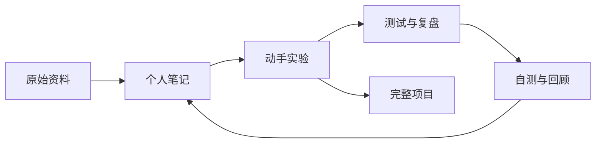

# AI Coding 与 Agent 学习知识库

> [!abstract] 知识库目标
> 从会使用对话式 AI，逐步掌握 LLM App、Workflow、Agent、工具调用、RAG、评估和完整项目开发。

## 从这里开始

- [[LEARNING_PATH|学习路径与当前进度]]
- [[AI_CODING_LEARNING_GUIDE|完整学习指南]]
- [[GLOSSARY|核心术语表]]
- [[notes/README|知识笔记]]
- [[labs/README|动手实验]]
- [[projects/README|完整项目]]
- [[prompts/README|提示词库]]
- [[reviews/README|复盘记录]]
- [[quizzes/README|自测题]]
- [[sources/README|原始资料]]

## 当前学习

| 项目 | 内容 |
|---|---|
| 当前阶段 | 第 1 章：Agent 基础 |
| 当前笔记 | [[notes/01-agent-workflow-llm-app|Agent、Workflow、LLM App 的区别]] |
| 当前练习 | [[notes/01-chapter1-exercise-answers|第一章习题参考答案]] |
| 下一步 | [[labs/01-minimal-agent-loop/README|实现最小 Agent Loop]] |

## 学习闭环

每学习一个主题，至少沉淀：一篇自己的笔记、一个可验证的练习、一次复盘和一组自测题。

## 内容状态

笔记 frontmatter 中统一使用以下状态：

- `draft`：刚建立，内容还不完整。
- `learning`：正在学习和补充。
- `understood`：已经能够用自己的话解释并完成练习。
- `review`：需要再次复习或修正。

## Obsidian 使用约定

1. 将本目录作为一个 Vault 打开。
2. 内部链接使用 `[[文件名]]` 或 `[[路径/文件名|显示名称]]`。
3. 新建内容时优先复制 `templates/` 中的模板。
4. 图片及附件统一放入 `assets/`。
5. 首页只做导航；原文、笔记、实验和复盘分别存放。
6. 不依赖第三方插件也能正常阅读，后续再按需要增加 Dataview 等插件。

> [!tip] 建议的 Obsidian 设置
> 将“新附件的默认位置”设为 `assets`，将“模板文件夹位置”设为 `templates`，并开启“自动更新内部链接”。

## Python 项目约定

本知识库中的 Python 实验和项目统一使用 `uv` 管理 Python 版本、依赖、锁文件和运行命令。每个可独立运行的实验应包含自己的 `pyproject.toml`、`.python-version` 和 `uv.lock`，不提交 `.venv/`。
